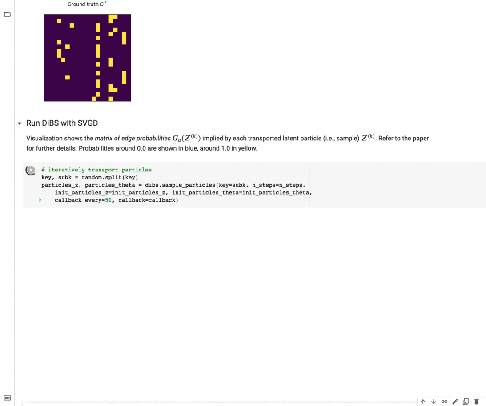

# DiBS: Differentiable Bayesian Structure Learning

[**Documentation**](https://differentiable-bayesian-structure-learning.readthedocs.io/)
| [**Quick Start**](#quick-start)
| [**Example Notebooks**](#example-notebooks)
| [**Change Log**](#change-log)
| [**Branches**](#branches-and-custom-installation)
| [**Reference**](#reference)

[](https://differentiable-bayesian-structure-learning.readthedocs.io/en/latest/?badge=latest)
[](https://pypi.org/project/dibs-lib/)


## Overview

This is the Python JAX implementation for *DiBS*  ([Lorch et al., 2021](https://arxiv.org/abs/2105.11839)), a fully differentiable method for joint Bayesian inference of the DAG and parameters of general, causal Bayesian networks.

In this implementation, DiBS inference is performed with the particle variational inference method *SVGD*  ([Liu and Wang, 2016](https://arxiv.org/abs/1608.04471)). 
Since DiBS and SVGD operate on continuous tensors and solely rely on Monte Carlo estimation and gradient ascent-like updates, the inference code leverages efficient vectorized operations, automatic differentiation, just-in-time compilation, and hardware acceleration, fully implemented with [JAX](https://github.com/google/jax). 

To install the latest stable release, run:

```bash
pip install dibs-lib
```


The documentation is linked here: 
[**Documentation**](https://differentiable-bayesian-structure-learning.readthedocs.io/).
If you work on Apple Silicon, we recommend using the compatible JAX versions `jax==0.2.10 jaxlib==0.1.60`

## Quick Start

The following code snippet demonstrates how to use the `dibs` package. 
In this example, we use DiBS to generate 10 DAG and parameter samples 
from the joint posterior over Gaussian Bayes nets with means modeled 
by neural networks.

```python
from dibs.inference import JointDiBS
from dibs.target import make_nonlinear_gaussian_model
import jax.random as random
key = random.PRNGKey(0)

# simulate some data
key, subk = random.split(key)
data, model = make_nonlinear_gaussian_model(key=subk, n_vars=20)

# sample 10 DAG and parameter particles from the joint posterior
dibs = JointDiBS(x=data.x, inference_model=model)
key, subk = random.split(key)
gs, thetas = dibs.sample(key=subk, n_particles=10, steps=1000)
```
In the above, the keyword argument `x` for `JointDiBS` is a matrix of shape `[N, d]` and could
be any real-world data set.


## Example Notebooks

For a working example of the above,  we recommend opening our example notebook in Google Colab, which runs **directly from your browser**. 
Whenever a GPU backend is available to JAX, the implementation will automatically leverage it to accelerate its computations. 
Thus, selecting the GPU runtime available in Google Colab will make inference significantly faster.

[](https://colab.research.google.com/github/larslorch/dibs/blob/master/examples/dibs_joint_colab.ipynb)

Analogous notebooks can be found inside the `examples/` folder.
Executing the code will generate samples from the joint posterior with DiBS and 
simultaneously visualize the matrices of edge probabilities modeled by the individual particles 
that are transported by SVGD during inference.

<br/><br/>
<p align="center">
	
</p>
<br/><br/>


## Change Log

- **Mar 14, 2022**: Published to PyPI


- **Mar 12, 2022**: Extended BGe marginal likelihood to be well-defined inside the probability simplex. 
The computation remains *exact* for binary entries but is well-behaved for soft relaxations of the graph.
This allows reparameterization (Gumbel-softmax) gradient estimation for the BGe score.

- **Dec 14, 2021**: Documentation added

## Branches and Custom Installation 

The repository consists of two branches:

- `master` (recommended, on PyPI): Lightweight and easy-to-use package for using DiBS in your research or applications.
- `full`: Comprehensive code to reproduce the experimental results in ([Lorch et al., 2021](https://arxiv.org/abs/2105.11839)). 
The purpose of this branch is reproducibility; the branch is not updated anymore and may contain outdated notation and documentation.

The latest stable release is published on PyPI, so the best way to install `dibs` is using `pip` as shown above.
For custom installations, we recommend using `conda` and generating a new environment via `environment.yml`.
Next, clone the code repository:
```
git clone https://github.com/larslorch/dibs.git
```
Finally, install the `dibs` package with
```
pip install -e .
```

## Reference
   
If you find this code useful, please cite our paper: 

```
@article{lorch2021dibs,
  title={DiBS: Differentiable Bayesian Structure Learning},
  author={Lorch, Lars and Rothfuss, Jonas and Sch{\"o}lkopf, Bernhard and Krause, Andreas},
  journal={Advances in Neural Information Processing Systems},
  volume={34},
  year={2021}
}
```
