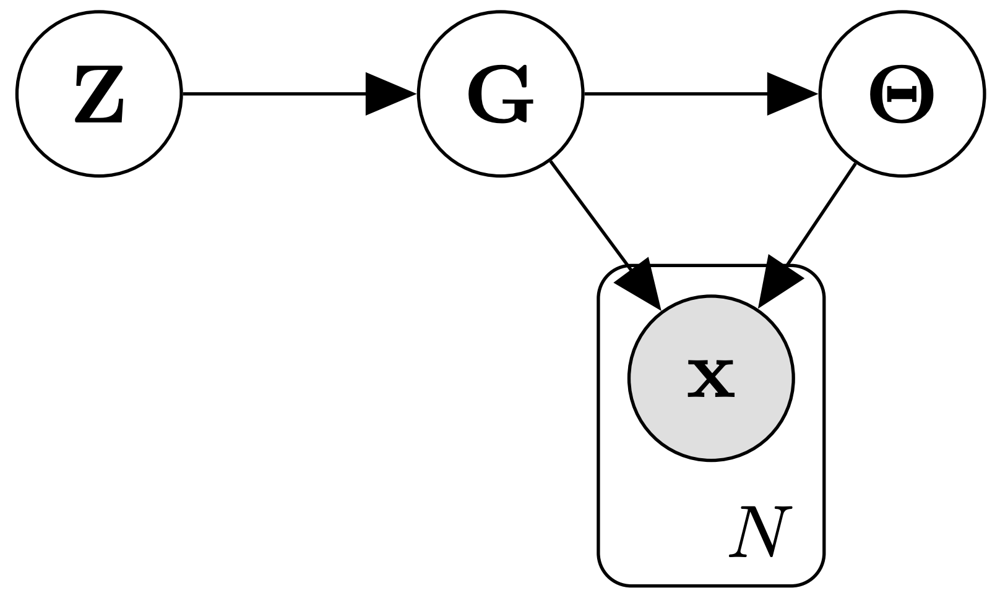

.. dibs documentation master file, created by
   sphinx-quickstart on Mon Dec 13 10:38:42 2021.
   You can adapt this file completely to your liking, but it should at least
   contain the root `toctree` directive.

Welcome to DiBS's documentation!
=====================================

This is the Python JAX implementation for
**DiBS: Differentiable Bayesian Structure Learning** (`Lorch et al., 2021`_).
This documentation specifies the API and interaction of the components
of the inference pipeline.
The entire code is writtn in `JAX`_ to leverage just-in-time compilation,
automatic differentation, vectorized operations, and
hardware acceleration.

DiBS translates learning :math:`p(G | D)` and :math:`p(G, \Theta | D)` over causal
Bayesian networks :math:`G, \Theta)`  into
inference over the continuous latent posterior densities
:math:`p(Z | D)` and :math:`p(Z, \Theta| D)`, respectively.
This extended generative assumptions is depicted by the following
graphical model:

|

|

Since we can estimate the scores :math:`\nabla_Z \log p(Z | D)`
and :math:`\nabla_Z \log p(Z, \Theta | D)`, general-purpose
approximate inference methods apply off-the-shelf.
Further information and experimental results can be found in the paper.

Inference
====================

In this repository, DiBS inference is implemented with
the particle variational inference method
*Stein Variational Gradient Descent* (SVGD) (`Liu and Wang, 2016`_).
To generate samples from :math:`p(Z | D)`, we randomly initialize a
set of particles :math:`\{ Z_m \}` and then roughly
execute the following steps using some kernel :math:`k` and step size :math:`\eta`:

**While not converged**:
   Estimate :math:`\nabla_{Z_k} \log p(Z_k | D )` for each :math:`Z_k` using REINFORCE/Gumbel-softmax

   **For** :math:`m=1` **to** :math:`M` **in parallel**:
      :math:`\displaystyle Z_m  \leftarrow Z_m +\eta \phi(Z_m) ~\text{where}~ \phi(\cdot) := \frac{1}{M} \sum_{k=1}^M k(Z_k, \cdot) \nabla_{Z_k} \log p(Z_k | D ) + \nabla_{Z_k} k(Z_k, \cdot)`

The analogous procedure applies when sampling from :math:`p(Z, \Theta | D)`,
where we jointly transport particles :math:`Z` and :math:`\Theta`.

.. _Lorch et al., 2021: https://arxiv.org/abs/2105.11839

.. _Liu and Wang, 2016: https://arxiv.org/abs/1711.07168

.. _JAX: https://github.com/google/jax

.. toctree::
   :maxdepth: 3
   :caption: Contents:

   dibs-custom.rst

Indices and tables
==================

* :ref:`genindex`
* :ref:`modindex`
* :ref:`search`
